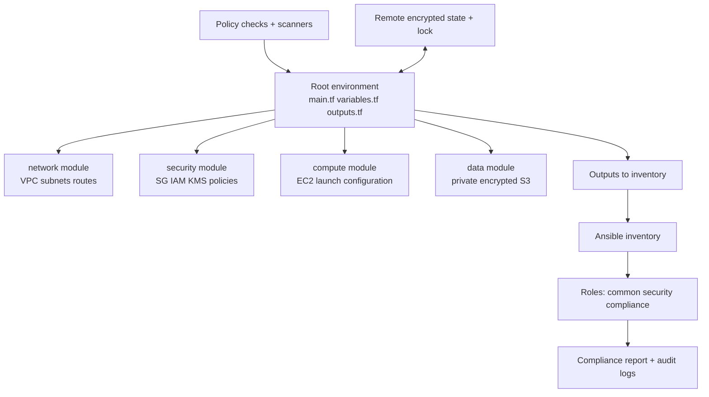
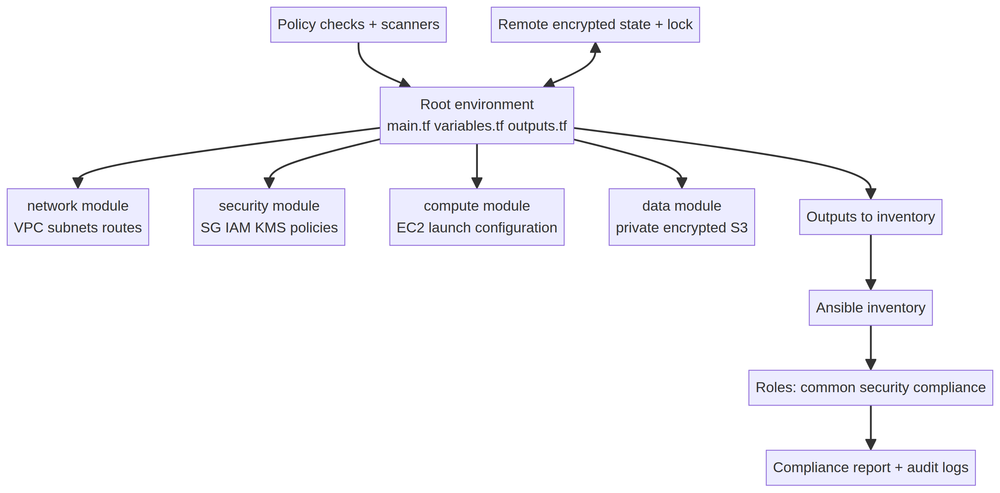

# Task 4 — Secure Infrastructure as Code Architecture

**Author:** Manus AI | **Track:** Advanced AI, Automation & Security Engineering

## Objective and control model

The proposed delivery model uses Terraform for declarative cloud provisioning and Ansible for host configuration. Terraform owns cloud resources and their dependencies. Ansible owns operating-system state after a host is reachable. A protected pipeline is the control plane: pull requests trigger formatting, validation, static analysis, policy checks, and a speculative plan; approved changes are applied by a short-lived workload identity. Separation of duties prevents a developer from silently changing both code and production state.

The repository is divided into reusable Terraform modules, environment composition, Ansible roles, policy tests, and documentation. Modules expose narrow variables with validation. Environment files select approved module versions rather than copying resources. Provider and module versions are pinned and verified. HashiCorp recommends treating providers and modules as dependencies that should be verified and controlled, and recommends protecting secrets from state and diagnostic output [1].

## State and secret management

Terraform state can contain resource attributes and should be treated as sensitive. Production state is stored remotely with encryption at rest, TLS in transit, versioning, access logging, and state locking. The state bucket is private and accessible only to the deployment role. A recovery point is retained before destructive changes. Local state is permitted only for disposable tests. State snapshots are not attached to tickets or logs.

Secrets are not variables committed to Git. CI retrieves them at runtime from a secret manager or workload identity integration. Sensitive Terraform variables are marked `sensitive`, but this is not a substitute for secret hygiene because values can still appear in state. Ansible Vault or an external secret lookup protects host credentials. Logs are configured to omit secret values. Key rotation is automated where the service supports it.

## Policy enforcement and compliance

Every plan passes syntax and validation checks, provider/module provenance checks, and security scanners such as Checkov or tfsec. Policy-as-code rejects public storage, unencrypted volumes, unrestricted SSH, missing tags, and unapproved regions. Ansible linting checks role structure and idempotency. Compliance rules map to CIS-style controls and produce a machine-readable result plus a human-readable report. Exceptions require an owner, business justification, compensating control, and expiration date.

## Drift detection and rollback

A scheduled read-only plan runs with `-detailed-exitcode`. Exit code zero means no difference; one indicates an error; two indicates drift or a pending change. Drift is triaged rather than overwritten automatically. Emergency out-of-band changes are captured in a ticket and reconciled into code. Rollback uses the last approved Git revision and a reviewed plan. For data-bearing resources, rollback is paired with backups and application-level recovery because recreating infrastructure does not restore data.

Ansible complements, rather than competes with, Terraform. Terraform creates the network, security group, instance, and storage. Ansible applies OS updates, SSH restrictions, firewall rules, audit logging, fail2ban, and compliance checks. A stable inventory is generated from cloud tags or a controlled inventory service. Playbooks are idempotent and run in check mode before enforcement. Handlers restart services only when configuration changes.

## Operational workflow

A change begins with a small pull request that identifies affected environments and controls. The pipeline runs formatting, validation, unit tests for policies, a plan, and a rendered compliance summary. Reviewers inspect both the diff and the planned actions. Approval grants a narrowly scoped apply identity for a short window. Post-deployment checks verify reachability, encryption, firewall exposure, logging, and expected outputs. The pipeline publishes plan metadata without publishing secrets.

Incident response can revoke the deployment role, quarantine the affected environment, and restore known-good state. The repository records the exact commit, provider versions, plan artifact, approvers, and applied timestamp. Central logs and cloud audit events support forensic reconstruction. Periodic access reviews remove stale keys and roles. This combination of technical controls and process controls makes the infrastructure reproducible without making it blindly autonomous.

## Terraform module structure diagram

## References

[1]: https://www.hashicorp.com/en/blog/terraform-security-5-foundational-practices "Terraform security: 5 foundational practices"
[2]: https://developer.hashicorp.com/terraform/cloud-docs/recommended-practices "Learn Terraform recommended practices"
[3]: https://developer.hashicorp.com/terraform/cloud-docs/architectural-details/security-model "HCP Terraform security model"

## Architecture diagram

The module boundary also limits blast radius. Network, security, compute, and data changes can be reviewed independently, while policy checks remain outside the modules so they cannot be bypassed by a convenient module default. The output-to-inventory link makes the handoff from cloud provisioning to host hardening explicit and testable.
