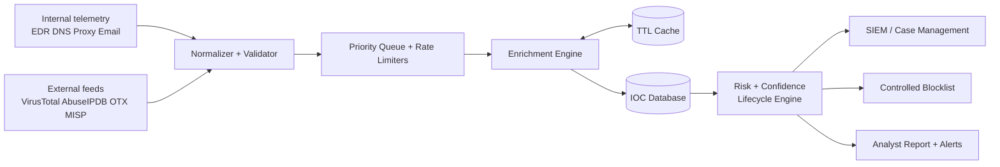
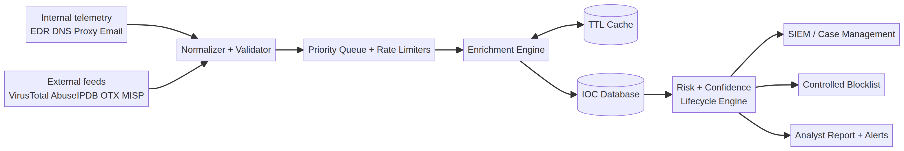

# Task 1 — Threat Intelligence Enrichment Architecture

**Author:** Manus AI | **Track:** Advanced AI, Automation & Security Engineering

## Objective and design

The proposed platform turns heterogeneous observations into governed, explainable intelligence for a security operations center (SOC). It separates collection, enrichment, scoring, storage, and response so that a slow provider or a noisy feed cannot block defensive action. The design treats an indicator of compromise (IOC) as a time-bounded observation rather than permanent truth. Every score is therefore accompanied by source evidence, timestamps, confidence, and an expiration policy.

## Data sources and ingestion

Internal sources include endpoint detection and response (EDR) telemetry, domain name system (DNS) logs, proxy records, email security alerts, firewall events, vulnerability scanners, and analyst-created observables. These sources provide organizational context such as affected asset, user, first-seen time, and observed action. External sources include VirusTotal, AbuseIPDB, AlienVault Open Threat Exchange (OTX), commercial feeds, and trusted information-sharing communities. MISP provides a useful interoperability model because it supports collecting, storing, distributing, and sharing cybersecurity indicators and threat information [1].

Collectors normalize each record into a canonical schema: value, type, source, observed time, event identifier, tenant, and handling label. Validation rejects malformed IP addresses, impossible hashes, control characters, and unsupported URL schemes. Deduplication uses a normalized indicator key, while provenance is retained as a separate list. The ingestion queue provides back-pressure and allows priority routing for indicators observed in active incidents.

## Enrichment engine and risk scoring

The enrichment engine fans out to the three required providers with per-provider quotas, bounded concurrency, exponential backoff, and a circuit breaker. A cache keyed by provider, indicator, and query version reduces repeated calls. A token-bucket limiter enforces VirusTotal’s free-tier rate limit and daily counters protect AbuseIPDB usage. Timeouts are short enough to keep alert handling responsive. A provider failure creates a partial result with an explicit error status; it never silently becomes a negative verdict.

The risk score is a transparent 0–100 weighted combination of provider evidence, recency, and source diversity. For example, a malicious verdict from multiple independent sources raises the score, while an old single-source observation decays toward zero. Confidence is separate from risk. Confidence increases with source diversity, repeated stable results, and recent observations. Analysts can inspect the component scores instead of receiving an opaque machine-learning label.

## IOC database and lifecycle

The IOC store keeps the current record plus append-only enrichment history. Required metadata includes first seen, last seen, expiration, confidence, risk score, sources, analyst disposition, and sharing policy. New IOCs begin as `active` with a conservative confidence value. Re-enrichment updates last seen and evidence. A scheduled expiration check moves stale records to `expired`; it does not delete historical evidence. Reappearance can reactivate an IOC while preserving the previous lifecycle.

False-positive prevention uses several controls. First, allowlists for corporate domains, known scanners, and shared infrastructure are checked before blocking. Second, high-impact actions require both an elevated score and minimum confidence. Third, indicators are correlated with local telemetry and asset context. Finally, analysts can suppress or override a verdict with a reason and expiration date. These controls prevent an isolated reputation hit from becoming an uncontrolled block.

## Workflow integration and operations

High-confidence indicators flow to the SIEM as searchable enrichment and to a controlled blocklist export for firewalls, DNS security, or endpoint tools. A case-management connector opens an analyst task when sources disagree or when an IOC affects a critical asset. Weekly reports summarize additions, expirations, provider health, false-positive overrides, and time-to-enrichment. Metrics include cache hit rate, provider error rate, queue latency, and percentage of indicators with independent corroboration.

Access is least-privilege. Provider keys are stored in a secret manager, never in source control. The database is encrypted at rest, audit logged, and partitioned by tenant. MISP export uses a controlled sharing profile so that internal context is not disclosed accidentally. Disaster recovery includes encrypted backups and a tested restore procedure. The architecture is therefore useful both as a learning implementation and as a foundation for a production service after governance review.

## Data flow diagram

## References

[1]: https://www.misp-project.org/ "MISP Open Source Threat Intelligence Platform"
[2]: https://www.misp-project.org/documentation/ "MISP Documentation and Support"

## Architecture diagram

The diagram emphasizes that the enrichment engine is not the system of record. The database preserves evidence and lifecycle state, while downstream integrations consume a governed decision. This distinction supports auditability when a provider changes its verdict or an analyst reverses a block.
